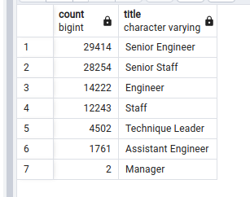
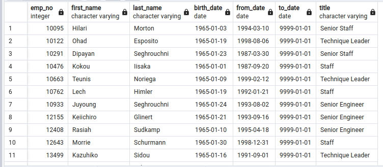

# Pewlett-Hackard-Analysis

## Overview
In this project, I explored and analyzed the employee database of a Pewlett-Hackard company to determine the following:
<ol>
<li>  Retiring employees, and their titles </li>
<li> Employees Eligible for the Mentorship Program </li>
</ol>

#### Database Schema

The table below shows the database schema which reflects the original tables presented in our database as well as the relationships amongst these tables. During the analysis, more tables are created and added to the database.

## Results

Below are the results of the analysis.

####  Out of the 300024 employees in our database, 90398 of them are to going to retire! That's 30.1 % of the total employees. Most of these retiring employees, due to  the retiring age constraint, are senior employees. 57668 out of the 90398 total retiring employees are seniors. That's toal of ~ 64 % of the total retiring employees.

####   To retrieve the employees eligible for mentorship program. Those employees are the **current employees who were born between January 1, 1965 and December 31, 1965.** the query retrieved 1549 employees eligible for the mentorship program. They are shown below.

## Summary
<ol>
<li> 30% of the total employees are retiring.
<li> 64% of the retiring employees are seniors
<li> There are 1549 current employees eligible for the mentorship program
